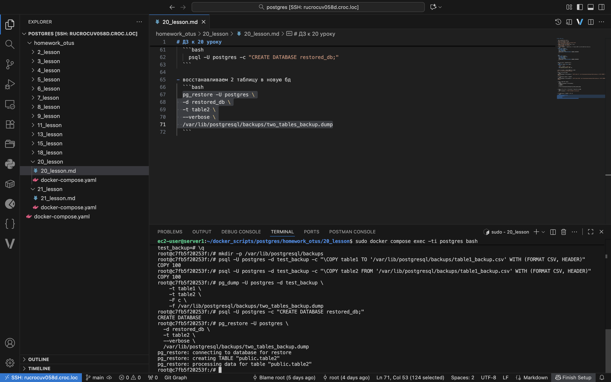
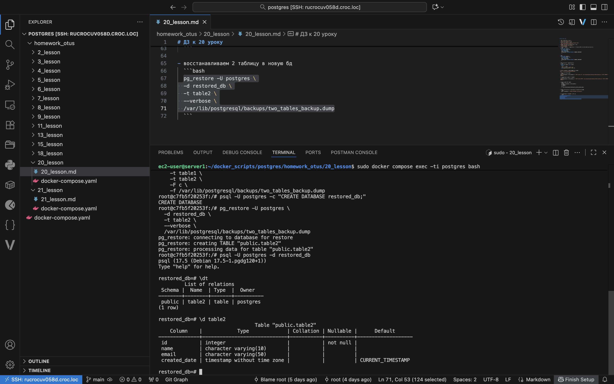

# ДЗ к 20 уроку

- разворачиваем пг в докере
  `sudo docker compose up -d`
- входим в контейнер и в psql
  `sudo docker compose exec -ti postgres bash`
  `psql -U postgres -d postgres`
- создаем тестовую БД и подключаемся к ней
  `CREATE DATABASE test_backup;`
  `\c test_backup`
- создаем 2 таблицы - 1 наполяняем, 2 оставляем пустой для последующего переноса
  ```sql
  CREATE TABLE table1 (
    id SERIAL PRIMARY KEY,
    name VARCHAR(10),
    email VARCHAR(50),
    created_date TIMESTAMP DEFAULT CURRENT_TIMESTAMP
    );
    ```

```sql
  CREATE TABLE table2 (
    id SERIAL PRIMARY KEY,
    name VARCHAR(10),
    email VARCHAR(50),
    created_date TIMESTAMP DEFAULT CURRENT_TIMESTAMP
    );
```

- наполняем первую таблицу данными
  ```sql
  INSERT INTO table1 (name, email)
    SELECT 
    'user_' || cnt, 
    'user_' || cnt || '@mail.com'
    FROM generate_series(1, 100) cnt;
    ```

- выходим из psql и создаем папку для бэкапов
`mkdir -p /var/lib/postgresql/backups`

- делаем логический бэкап
  ```bash
  psql -U postgres -d test_backup -c "\COPY table1 TO '/var/lib/postgresql/backups/table1_backup.csv' WITH (FORMAT CSV, HEADER)"
  ```
- восстанавливаем бэкап в 2 таблицу
  ```bash
  psql -U postgres -d test_backup -c "\COPY table2 FROM '/var/lib/postgresql/backups/table1_backup.csv' WITH (FORMAT CSV, HEADER)"
  ```

- создаем бэкап двух таблиц
  ```bash
    pg_dump -U postgres -d test_backup \
    -t table1 \
    -t table2 \
    -F c \
    -f /var/lib/postgresql/backups/two_tables_backup.dump
  ```

- создаем новую бд для восстановления 2 табюлицы из бэкапа
  ```bash
    psql -U postgres -c "CREATE DATABASE restored_db;"
  ```

- восстанавливаем 2 таблицу в новую бд
  ```bash
  pg_restore -U postgres \
  -d restored_db \
  -t table2 \
  --verbose \
  /var/lib/postgresql/backups/two_tables_backup.dump
  ```



