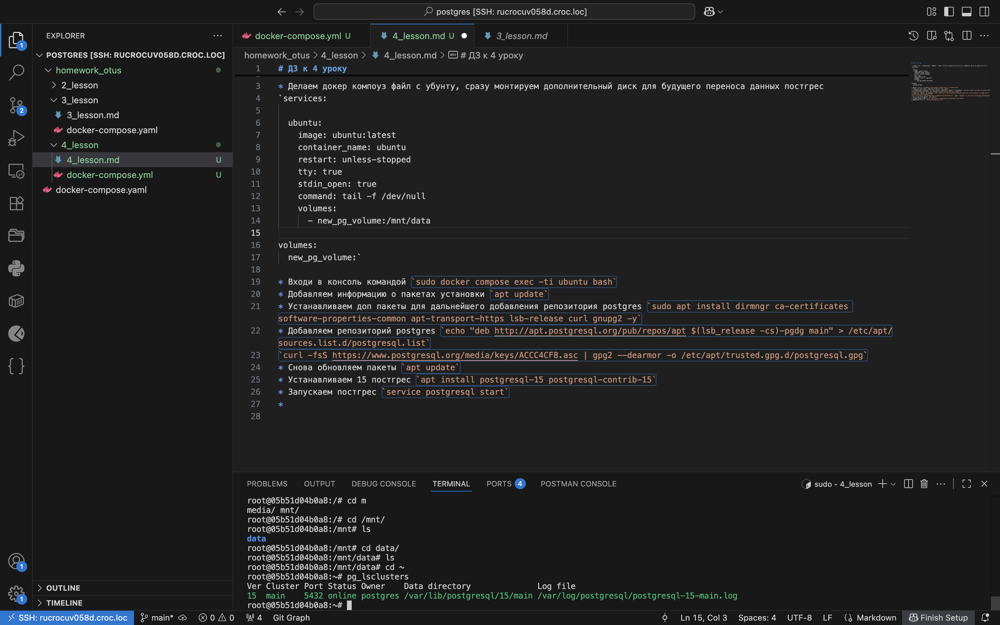
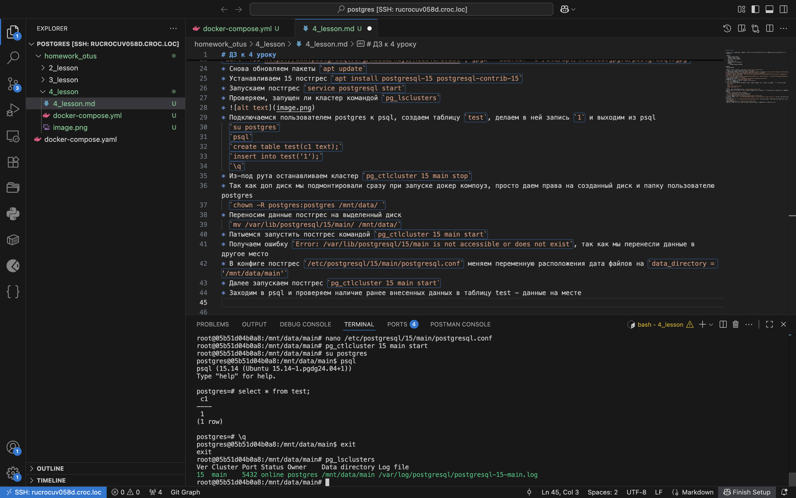
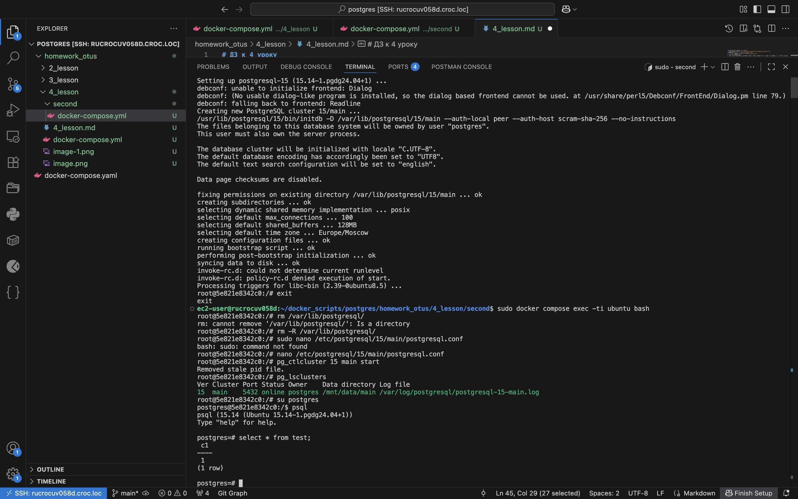

# ДЗ к 4 уроку

* Делаем докер компоуз файл с убунту, сразу монтируем дополнительный диск для будущего переноса данных постгрес
`services:

  ubuntu:
    image: ubuntu:latest
    container_name: ubuntu
    restart: unless-stopped
    tty: true
    stdin_open: true
    command: tail -f /dev/null
    volumes:
      - new_pg_volume:/mnt/data
  
volumes:
  new_pg_volume:
    name: new_pg_volume
    external: true`

* Входи в консоль командой `sudo docker compose exec -ti ubuntu bash`
* Добавляем информацию о пакетах установки `apt update`
* Устанавливаем доп пакеты для дальнейшего добавления репозитория postgres `apt install dirmngr ca-certificates software-properties-common apt-transport-https lsb-release curl gnupg2 nano -y`
* Добавляем репозиторий postgres `echo "deb http://apt.postgresql.org/pub/repos/apt $(lsb_release -cs)-pgdg main" > /etc/apt/sources.list.d/postgresql.list`
`curl -fsS https://www.postgresql.org/media/keys/ACCC4CF8.asc | gpg2 --dearmor -o /etc/apt/trusted.gpg.d/postgresql.gpg`
* Снова обновляем пакеты `apt update`
* Устанавливаем 15 постгрес `apt install postgresql-15 postgresql-contrib-15 -y`
* Запускаем постгрес `service postgresql start`
* Проверяем, запущен ли кластер командой `pg_lsclusters`
* 
* Подключаемся пользователем postgres к psql, создаем таблицу `test`, делаем в ней запись `1` и выходим из psql
  `su postgres`
  `psql`
  `create table test(c1 text);`
  `insert into test values('1');`
  `\q`
* Из-под рута останавливаем кластер `pg_ctlcluster 15 main stop`
* Так как доп диск мы подмонтировали сразу при запуске докер компоуз, просто даем права на созданный диск и папку пользователю postgres
  `chown -R postgres:postgres /mnt/data/ `
* Переносим данные постгрес на выделенный диск
  `mv /var/lib/postgresql/15/main/ /mnt/data/`
* Патыемся запустить постгрес командой `pg_ctlcluster 15 main start` 
* Получаем ошибку `Error: /var/lib/postgresql/15/main is not accessible or does not exist`, так как мы перенесли данные в другое место
* В конфиге постгрес `/etc/postgresql/15/main/postgresql.conf` меняем переменную расположения дата файлов на `data_directory = '/mnt/data/main'`
* Далее запускаем постгрес `pg_ctlcluster 15 main start` 
* Заходим в psql и проверяем наличие ранее внесенных данных в таблицу test - данные на месте
  
* Если бы мы захотели поменять расположение данных постгрес, но не перенесли бы сами данные, изменив конфиг, сервер бы не завелся. В данном случае нужно було бы выполнить инициализацию командой `su postgres /usr/lib/postgresql/17/bin/initdb -D /mnt/data`
* Делаем еще 1 файл докер компоуз с другим названием контейнера, но с таким же диском
* Входим в контейнер все теми же методами, описанными выше
* Устанавливаем пакеты, саму постгрес. Делаем все то же самое, как и в первом случае
* Удаляем основную папку для данных постгрес, правим конфиг и спокойно используем те же данные, что и первый контейнер
* 
  
