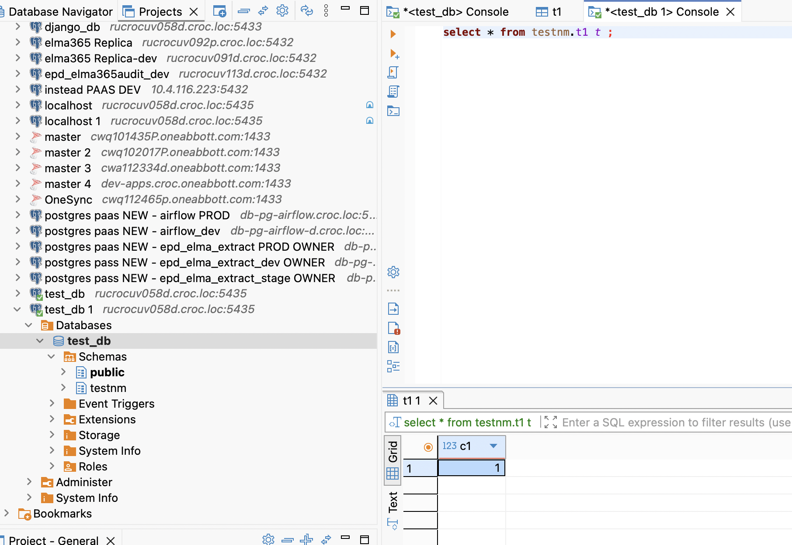
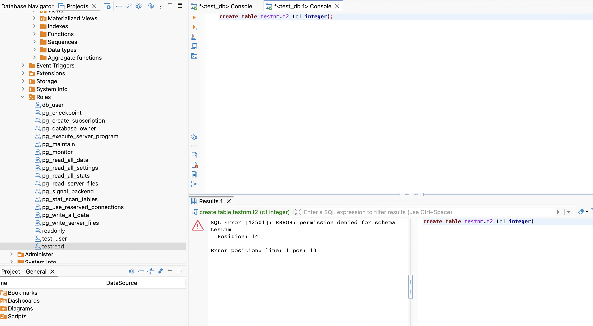

# ДЗ к 5 уроку
* Поднимаем БД в докер компоуз
  `sudo docker compose up -d`
* Входим в контейнер
  `sudo docker compose exec -ti postgres bash`
* Входим в psql
  `psql -U db_user -d test_db`
* Создаем схему
  `create schema testnm;`
* Создаем таблицу с 1 колонкой
  `create table testnm.t1 (c1 integer);`
* Вставляем данные
  `insert into testnm.t1 values (1);`
* Создаем роль
  `create role readonly;`
* Даем роли возможность подключаться к БД
  `grant connect on database test_db to readonly;`
* Даем роли право использовать схему
  `grant usage on schema "testnm" to "readonly";`
* Даем право на select всех таблиц в схеме
  `grant select on all tables in schema "testnm" to readonly;`
* Создаем пользователя
  `create user testread with password 'test123';`
* Назначаем пользователю группу readonly
  `grant readonly to testread;`
* Заходим под новым пользователем и делаем select
  
  `select * from testnm.t1 t ;`
* Пункты 16-36. Делал без шпор. При создании таблицы лучше всегда указывать схему. По дефолту схема идет public. при необходимости можно изменить search_path в сессии или на постоянной основе (но так лучше не надо)
* Пункты 37-42  - создание и вставка не прокатят, так как прав таких выдано для роли и пользователя не было
  