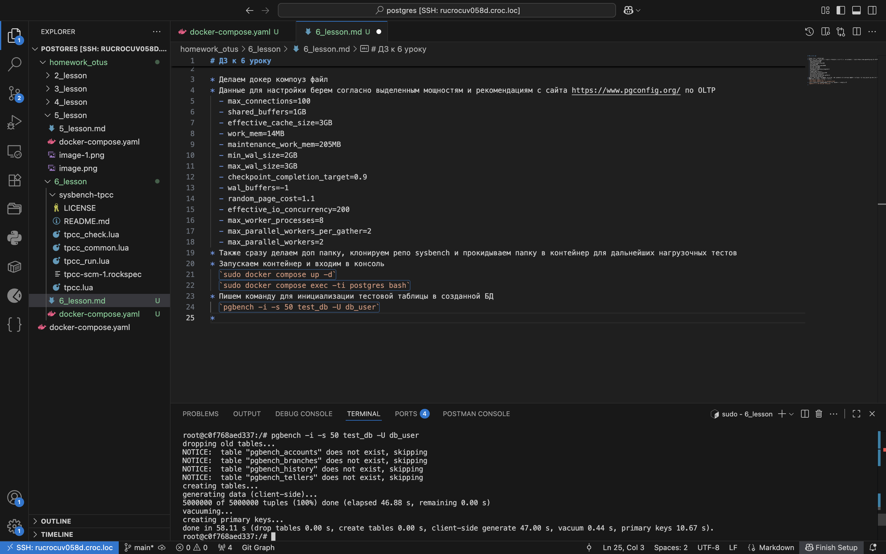
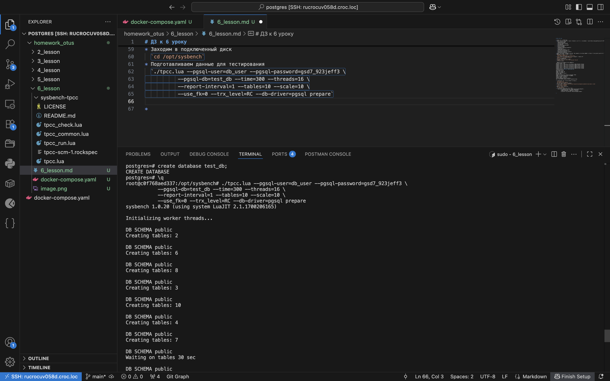
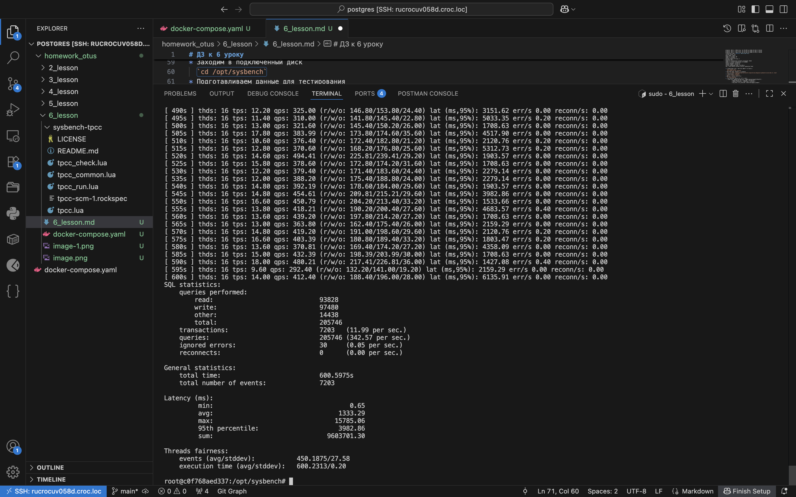

# ДЗ к 6 уроку

* Делаем докер компоуз файл
* Данные для настройки берем согласно выделенным мощностям и рекомендациям с сайта https://www.pgconfig.org/ по OLTP
  - max_connections=100
  - shared_buffers=1GB
  - effective_cache_size=3GB
  - work_mem=14MB
  - maintenance_work_mem=205MB
  - min_wal_size=2GB
  - max_wal_size=3GB
  - checkpoint_completion_target=0.9
  - wal_buffers=-1
  - random_page_cost=1.1
  - effective_io_concurrency=200
  - max_worker_processes=8
  - max_parallel_workers_per_gather=2
  - max_parallel_workers=2
* Также сразу делаем доп папку, клонируем репо sysbench и прокидываем папку в контейнер для дальнейших нагрузочных тестов
* Запускаем контейнер и входим в консоль
  `sudo docker compose up -d`
  `sudo docker compose exec -ti postgres bash`
* Пишем команду для инициализации тестовой таблицы в созданной БД
  `pgbench -i -s 50 test_db -U db_user`
  
* Начинаем нагрузовное тестирование
  `pgbench -c 50 -j 2 -P 10 -T 60 -U db_user test_db`
* Полученные данные

  pgbench (15.14 (Debian 15.14-1.pgdg13+1))
starting vacuum...end.
progress: 10.0 s, 1022.5 tps, lat 47.995 ms stddev 96.458, 0 failed
progress: 20.0 s, 1274.7 tps, lat 38.726 ms stddev 79.604, 0 failed
progress: 30.0 s, 1248.7 tps, lat 39.515 ms stddev 72.431, 0 failed
progress: 40.0 s, 1236.6 tps, lat 39.879 ms stddev 63.135, 0 failed
progress: 50.0 s, 1177.8 tps, lat 41.873 ms stddev 67.403, 0 failed
progress: 60.0 s, 1366.9 tps, lat 36.164 ms stddev 34.748, 0 failed
transaction type: <builtin: TPC-B (sort of)>
scaling factor: 50
query mode: simple
number of clients: 50
number of threads: 2
maximum number of tries: 1
duration: 60 s
number of transactions actually processed: 73318
number of failed transactions: 0 (0.000%)
latency average = 40.519 ms
latency stddev = 70.562 ms
initial connection time = 55.120 ms
tps = 1214.184794 (without initial connection time)

* Устанавливаем curl, обновляем пакеты контейнера
  `apt install curl`
  `apt update && apt upgrade`
* Скачиваем файл репозитория sysbench
  `curl -s https://packagecloud.io/install/repositories/akopytov/sysbench/script.deb.sh | bash`
* Устанавливаем `sysbench`
  `apt -y install sysbench`
* Заходим в подключенный диск
  `cd /opt/sysbench`
* Подготавливаем данные для тестирования
  `./tpcc.lua --pgsql-user=db_user --pgsql-password=gsd7_923jeff3 \
           --pgsql-db=test_db --time=300 --threads=16 \
           --report-interval=1 --tables=10 --scale=10 \
           --use_fk=0 --trx_level=RC --db-driver=pgsql prepare` 
  
* Далее запускаем базовый тест
  `./tpcc.lua --pgsql-user=db_user --pgsql-password=pagsd7_923jeff3ssword \
           --pgsql-db=test_db --time=600 --threads=16 \
           --report-interval=5 --tables=10 --scale=10 \
           --use_fk=0 --trx_level=RC --db-driver=pgsql run`
* Плохие результаты тестирования связаны с "зажатостью" постгрес в докере и слабым hdd на машине (не ssd)
  