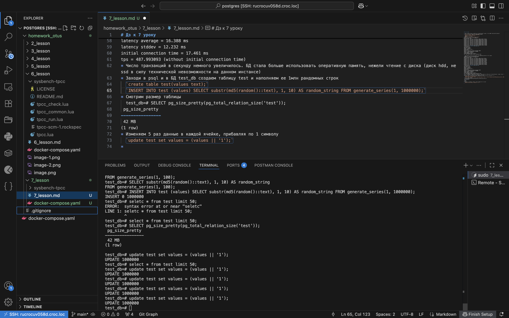
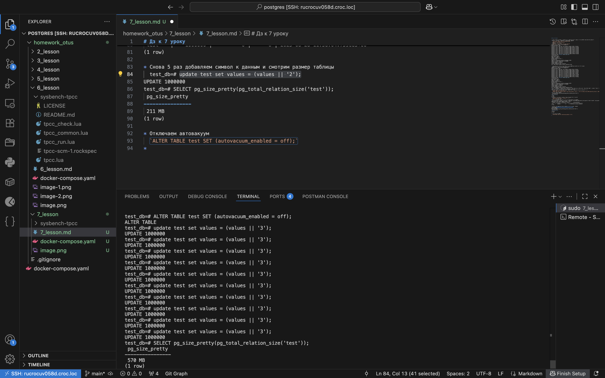
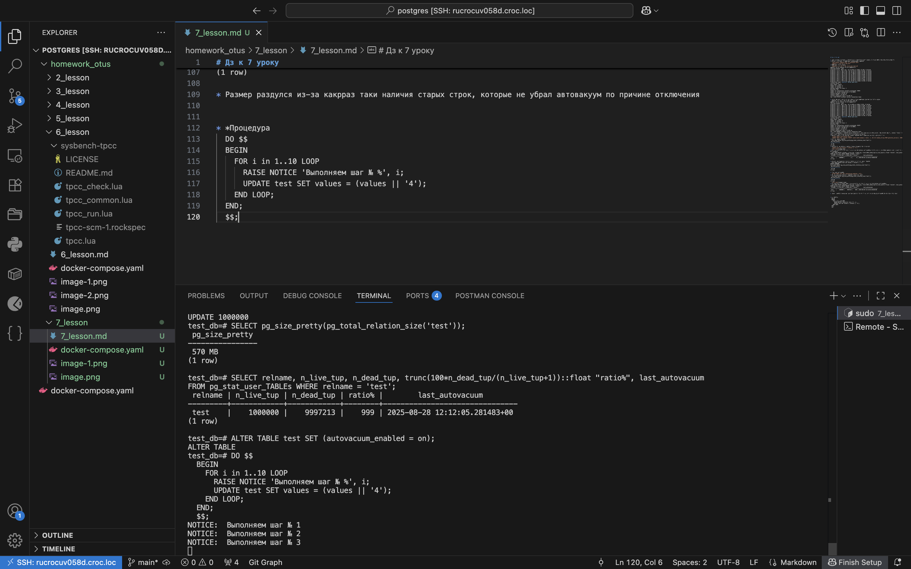

# Дз к 7 уроку

* Разворачиваем контейнер с 15 постгрес с дефолтными настройками, 2 ядрами цпу и 4гб оперативной памяти
* Входим в контейнер и запускаем инициализацию pgbench
  `sudo docker compose exec -ti postgres bash`
  `pgbench -i test_db -U db_user`
* Запускаем тестирование
  `pgbench -c 8 -P6 -T 60 -U db_user test_db`
pgbench (15.14 (Debian 15.14-1.pgdg13+1))
starting vacuum...end.
progress: 6.0 s, 495.5 tps, lat 16.076 ms stddev 12.555, 0 failed
progress: 12.0 s, 491.5 tps, lat 16.276 ms stddev 10.641, 0 failed
progress: 18.0 s, 490.5 tps, lat 16.303 ms stddev 10.768, 0 failed
progress: 24.0 s, 467.8 tps, lat 17.090 ms stddev 23.233, 0 failed
progress: 30.0 s, 491.5 tps, lat 16.285 ms stddev 10.684, 0 failed
progress: 36.0 s, 484.0 tps, lat 16.524 ms stddev 12.914, 0 failed
progress: 42.0 s, 482.3 tps, lat 16.578 ms stddev 11.069, 0 failed
progress: 48.0 s, 476.5 tps, lat 16.788 ms stddev 10.517, 0 failed
progress: 54.0 s, 483.7 tps, lat 16.530 ms stddev 11.062, 0 failed
progress: 60.0 s, 473.0 tps, lat 16.921 ms stddev 13.938, 0 failed
transaction type: <builtin: TPC-B (sort of)>
scaling factor: 1
query mode: simple
number of clients: 8
number of threads: 1
maximum number of tries: 1
duration: 60 s
number of transactions actually processed: 29026
number of failed transactions: 0 (0.000%)
latency average = 16.532 ms
latency stddev = 13.203 ms
initial connection time = 15.487 ms
tps = 483.775770 (without initial connection time)

* Меняем параметры постгрес на другие и снова запускаем нагрузочное тестирование
  pgbench -c 8 -P6 -T 60 -U db_user test_db
pgbench (15.14 (Debian 15.14-1.pgdg13+1))
starting vacuum...end.
progress: 6.0 s, 501.8 tps, lat 15.869 ms stddev 9.515, 0 failed
progress: 12.0 s, 450.3 tps, lat 17.756 ms stddev 22.901, 0 failed
progress: 18.0 s, 498.0 tps, lat 16.056 ms stddev 8.945, 0 failed
progress: 24.0 s, 491.3 tps, lat 16.279 ms stddev 10.286, 0 failed
progress: 30.0 s, 496.8 tps, lat 16.100 ms stddev 9.318, 0 failed
progress: 36.0 s, 497.5 tps, lat 16.071 ms stddev 9.029, 0 failed
progress: 42.0 s, 486.0 tps, lat 16.467 ms stddev 11.919, 0 failed
progress: 48.0 s, 480.8 tps, lat 16.632 ms stddev 12.268, 0 failed
progress: 54.0 s, 494.2 tps, lat 16.190 ms stddev 9.397, 0 failed
progress: 60.0 s, 481.7 tps, lat 16.597 ms stddev 13.416, 0 failed
transaction type: <builtin: TPC-B (sort of)>
scaling factor: 1
query mode: simple
number of clients: 8
number of threads: 1
maximum number of tries: 1
duration: 60 s
number of transactions actually processed: 29279
number of failed transactions: 0 (0.000%)
latency average = 16.388 ms
latency stddev = 12.232 ms
initial connection time = 17.461 ms
tps = 487.993093 (without initial connection time)
* Число транзакций в секунду немного увеличилось. БД стала больше использовать оперативную память, нежели чтение с диска (диск hdd, не ssd в силу технической невозможности на данном инстансе)
* Заходи в psql и в БД test_db создаем таблицу test и наполняем ее 1млн рандомных строк
  `create table test(values text);`
  `INSERT INTO test (values) SELECT substr(md5(random()::text), 1, 10) AS random_string FROM generate_series(1, 1000000);`
* Смотрим размер таблицы
  test_db=# SELECT pg_size_pretty(pg_total_relation_size('test'));
 pg_size_pretty 
----------------
 42 MB
(1 row)
* Изменяем 5 раз данные в каждой ячейке, прибавляя по 1 символу
  `update test set values = (values || '1');`
  
* Смотрим количество мертвых строк и время последнего автовакуума (честно говоря, не успел зафиксировать момент до отработки автовакуума)
  test_db=# SELECT relname, n_live_tup, n_dead_tup, trunc(100*n_dead_tup/(n_live_tup+1))::float "ratio%", last_autovacuum 
FROM pg_stat_user_TABLEs WHERE relname = 'test';
 relname | n_live_tup | n_dead_tup | ratio% |        last_autovacuum        
---------+------------+------------+--------+-------------------------------
 test    |    1000000 |          0 |      0 | 2025-08-28 11:58:04.759685+00
(1 row)

* Снова 5 раз добавляем символ к данным и смотрим размер таблицы
  test_db=# update test set values = (values || '2');
UPDATE 1000000
test_db=# SELECT pg_size_pretty(pg_total_relation_size('test'));
 pg_size_pretty 
----------------
 211 MB
(1 row)

* Отключаем автовакуум
  `ALTER TABLE test SET (autovacuum_enabled = off);`
* 10 раз обновляем данные в таблице и измеряем размер
  test_db=# SELECT pg_size_pretty(pg_total_relation_size('test'));
 pg_size_pretty 
----------------
 570 MB
(1 row)
  
* Для наглядности делаем запрос на количество мертвых строк и время последнего автовакуума
  test_db=# SELECT relname, n_live_tup, n_dead_tup, trunc(100*n_dead_tup/(n_live_tup+1))::float "ratio%", last_autovacuum 
FROM pg_stat_user_TABLEs WHERE relname = 'test';
 relname | n_live_tup | n_dead_tup | ratio% |        last_autovacuum        
---------+------------+------------+--------+-------------------------------
 test    |    1000000 |    9997213 |    999 | 2025-08-28 12:12:05.281483+00
(1 row)

* Размер раздулся из-за какрраз таки наличия старых строк, которые не убрал автовакуум по причине отключения

* *Процедура
  DO $$
  BEGIN
    FOR i in 1..10 LOOP
      RAISE NOTICE 'Выполняем шаг № %', i;
      UPDATE test SET values = (values || '4');
    END LOOP;
  END;
  $$;
