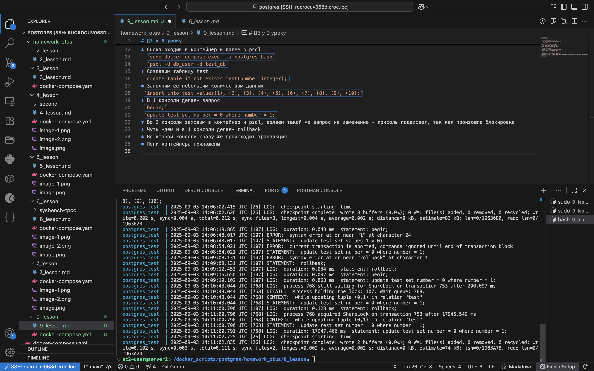
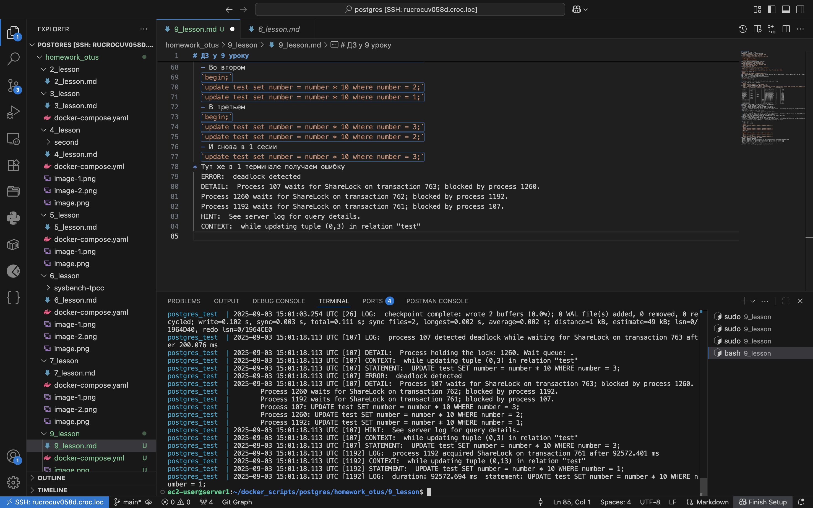

# ДЗ у 9 уроку
* Поднимаем постгрес в докер
* Заходим в командную строку контейнера
  `sudo docker compose exec -ti postgres bash`
* Меняем в файле конфигурации настроки
  `nano /var/lib/postgresql/data/postgresql.conf`
  `log_lock_waits = on`
  `deadlock_timeout = 200ms`
  `log_min_duration_statement = 0`
* Выходим из контейнера и перезагружаем его 
  `sudo docker compose restart postgres`
* Снова входив в контейнер и далее в psql
  `sudo docker compose exec -ti postgres bash`
  `psql -U db_user -d test_db`
* Создадим таблицу test 
 `create table if not exists test(number integer);`
* Заполним ее небольшим количеством данных
 `insert into test values(1), (2), (3), (4), (5), (6), (7), (8), (9), (10);`
* В 1 консоли делаем запрос
 `begin;`
 `update test set number = 0 where number = 1;`
* Во 2 консоли заходим в контейнер и psql, делаем такой же запрос на изменение - консоль подвисает, так как произошла блокировка
* Чуть ждем и в 1 консоли делаем rollback
* Во второй консоли сразу же происходит транзакция
* Логи контейнера приложены
  

* Открываем теперь третью консоль и также входим в контейнер и psql
* Во всех окнах начинаем транзакцию
  `begin;`
  `update test set number = 1 where number = 0;`
* Далее в 1 консоли запрашиваем список блокировок
  `SELECT locktype, relation::REGCLASS, virtualxid AS virtxid, transactionid AS xid, mode, granted, pid FROM pg_locks;` 
   locktype    | relation | virtxid | xid |       mode       | granted | pid  
---------------+----------+---------+-----+------------------+---------+------
 relation      | pg_locks |         |     | AccessShareLock  | t       |  107
 relation      | test     |         |     | RowExclusiveLock | t       |  107
 virtualxid    |          | 8/9     |     | ExclusiveLock    | t       |  107
 relation      | test     |         |     | RowExclusiveLock | t       | 1192
 virtualxid    |          | 38/3    |     | ExclusiveLock    | t       | 1192
 relation      | test     |         |     | RowExclusiveLock | t       | 1260
 virtualxid    |          | 46/3    |     | ExclusiveLock    | t       | 1260
 tuple         | test     |         |     | ExclusiveLock    | f       | 1260
 tuple         | test     |         |     | ExclusiveLock    | t       | 1192
 transactionid |          |         | 757 | ExclusiveLock    | t       | 1260
 transactionid |          |         | 756 | ExclusiveLock    | t       | 1192
 transactionid |          |         | 755 | ExclusiveLock    | t       |  107
 transactionid |          |         | 755 | ShareLock        | f       | 1192
* К команде добавил pid, чтобы проще было смотреть зависимости
* 107 пид - сверху вниз (первый терминал)
  - читает таблицу pg_locks - из нее мы и запросили данные
  - имеет строковую блокировку в таблице test, модифицирует ее
  - так как транзакция начата, но нет ни коммита, ни ролбэка, имеет 2 эксклюзивные блокировки на виртуальный айди и реальный айди транзакции
* 1192 пид - сверху вниз (второй терминал)
  - имеет строковую блокировку в таблице test, модифицирует ее
  - так как транзакция начата, но нет ни коммита, ни ролбэка, имеет 2 эксклюзивные блокировки на виртуальный айди и реальный айди 
  - имеет эксклюзивную блокировку tuple (даныне на изменение)
  - имеет блокировку sharelock - false на транзакцию 755 (совершается пидом 107)
* 1260 пид - сверху вниз (третий терминал)
  - имеет строковую блокировку в таблице test, модифицирует ее
  - так как транзакция начата, но нет ни коммита, ни ролбэка, имеет 2 эксклюзивные блокировки на виртуальный айди и реальный айди
  - ждет эксклюзивную блокировку tuple - в нашем случае exclusiveLock false

* Заимная блокировка
  - В первом терминале
  `begin;`
  `update test set number = number * 10 where number = 1;`
  - Во втором
  `begin;`
  `update test set number = number * 10 where number = 2;`
  `update test set number = number * 10 where number = 1;`
  - В третьем
  `begin;`
  `update test set number = number * 10 where number = 3;`
  `update test set number = number * 10 where number = 2;`
  - И снова в 1 сесии
  `update test set number = number * 10 where number = 3;`
* Тут же в 1 терминале получаем ошибку
  ERROR:  deadlock detected
  DETAIL:  Process 107 waits for ShareLock on transaction 763; blocked by process 1260.
  Process 1260 waits for ShareLock on transaction 762; blocked by process 1192.
  Process 1192 waits for ShareLock on transaction 761; blocked by process 107.
  HINT:  See server log for query details.
  CONTEXT:  while updating tuple (0,3) in relation "test"
* В логах можно увидеть все ошибки о взаимной блокировке
  
  - второй терминал ждем окончание первого
  - третий окончания второго
  - первый окончания третьего

* Считаю, что взаимной блокировки при одновременном обновлении таблицы без указания WHERE быть не может

